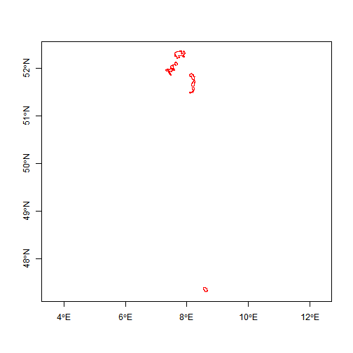
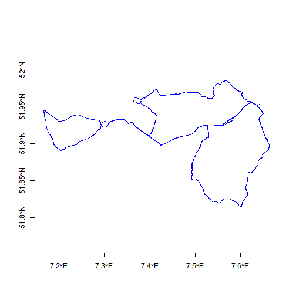

# AGGREGATION OF TRAJECTORIES

-------------

## Homework

* Use trajectory aggregation to describe how Holger's cycling differs from mine
* Comparisons can be qualitative (visual) or quantitative (numeric)


```r
require(trajectories)
```

```
## Loading required package: trajectories
```

```r
require(spacetime)
```

```
## Loading required package: spacetime
```

```r
require(maptools)
```

```
## Loading required package: maptools
```

```
## Warning in library(package, lib.loc = lib.loc, character.only = TRUE,
## logical.return = TRUE, : there is no package called 'maptools'
```

```r
#Sys.setenv(JAVA_HOME='C:\\Program Files\\Java\\jre7')
require(OpenStreetMap)
```

```
## Loading required package: OpenStreetMap
## Loading required package: rJava
## Loading required package: raster
## Loading required package: sp
## Loading required package: rgdal
## rgdal: version: 0.9-1, (SVN revision 518)
## Geospatial Data Abstraction Library extensions to R successfully loaded
## Loaded GDAL runtime: GDAL 1.11.0, released 2014/04/16
## Path to GDAL shared files: C:/Users/Da/R/win-library/3.1/rgdal/gdal
## GDAL does not use iconv for recoding strings.
## Loaded PROJ.4 runtime: Rel. 4.8.0, 6 March 2012, [PJ_VERSION: 480]
## Path to PROJ.4 shared files: C:/Users/Da/R/win-library/3.1/rgdal/proj
```

```r
require(ggplot2)
```

```
## Loading required package: ggplot2
```

```
## Warning in library(package, lib.loc = lib.loc, character.only = TRUE,
## logical.return = TRUE, : there is no package called 'ggplot2'
```

```r
require (rgdal)
require (maptools)
```

```
## Loading required package: maptools
```

```
## Warning in library(package, lib.loc = lib.loc, character.only = TRUE,
## logical.return = TRUE, : there is no package called 'maptools'
```

```r
require(plotKML)
```

```
## Loading required package: plotKML
## plotKML version 0.4-5 (2014-07-30)
## URL: http://plotkml.r-forge.r-project.org/
```

```r
## Holger's Cycle Tracks

getTr <- function (file) {
  tr <- readGPX (file)
  tr <- tr$tracks[[1]][[1]]
  crs <- CRS ("+proj=longlat")
  sp <- SpatialPoints (tr[,1:2], crs)
  t <- as.POSIXct(strptime(tr$time, "%Y-%m-%dT%H:%M:%SZ"))
  stidf <- STIDF (sp, t, data.frame (tr$ele))
  as (stidf, "Track")
}

ddir <- "dat/gpx-tracks/"
files <- list.files (ddir)
files <- as.character (sapply (files, function (x) paste (ddir, x, sep="")))
runs <- rides1 <- list ()
for (f in files) {
  cat (f, "\n")
  tr <- getTr (f)
  if (length (grep ("Running", f)) > 0) 
  {
  runs <- c (runs, tr)
  }
  else
  {
  rides1 <- c (rides1, tr)
  }
}
```

```
## dat/gpx-tracks/2014-03-18-Running.gpx 
## dat/gpx-tracks/2014-03-30-Running.gpx 
## dat/gpx-tracks/2014-05-14-Racebike.gpx 
## dat/gpx-tracks/2014-06-08-Racebike.gpx 
## dat/gpx-tracks/2014-07-12-Racebike.gpx 
## dat/gpx-tracks/2014-08-06-Racebike.gpx 
## dat/gpx-tracks/2014-08-14-Running.gpx 
## dat/gpx-tracks/2014-08-16-Racebike.gpx 
## dat/gpx-tracks/2014-08-17-Running.gpx 
## dat/gpx-tracks/2014-08-29-Racebike.gpx 
## dat/gpx-tracks/2014-09-20-Racebike.gpx
```

```r
holger <- TracksCollection(list(rides1=Tracks(rides1)))
plot(holger, col="red")
```

 

```r
## Mark's Cycle Tracks

getTr <- function (file) {
    tr <- readGPX (file)
    tr <- tr$tracks[[1]][[1]]
    crs <- CRS ("+proj=longlat")
    sp <- SpatialPoints (tr[,1:2], crs)
    t <- as.POSIXct(strptime(tr$time, "%Y-%m-%dT%H:%M:%OSZ"))
    stidf <- STIDF (sp, t, data.frame (tr$ele))
    as (stidf, "Track")
  }


ddir <- "dat/gpx-tracks-mp/"
files <- list.files (ddir)
files <- as.character (sapply (files, function (x) paste (ddir, x, sep="")))
rides2 <- list ()
for (f in files) {
  cat (f, "\n")
  rides2 <- c (rides2, getTr (f))
}
```

```
## dat/gpx-tracks-mp/activity_600897367.gpx 
## dat/gpx-tracks-mp/activity_603849790.gpx 
## dat/gpx-tracks-mp/activity_605276709.gpx
```

```r
mark <- TracksCollection (list (rides2=Tracks (rides2)))
plot (mark, col="blue", lwd=1)
```

 

```r
tracklength <- function(x) {
  
  l <- length(x) - 1
  distance <- 0
  
  for(i in 1:l) { 
    x1 <-x[i,]
    x2 <- x[i+1,]
    gap <- (spDists(x1, x2, longlat = TRUE)) * 1000
    distance <- distance + gap
  }
  
  as.numeric(distance)
}

tracklength(holger@tracksCollection$rides1@tracks$Track1@sp)
```

```
## [1] 13142.25
```

---


<span style="color:green"; font-size:2em>
Holger:
Tracks are from Münster, Möhnesee and Zürich
TracksCollection contains both cycling and running


Mark:
Tracks are only from Münster
TracksCollection contains only cycling: Therefore, we only compare these with Holger's cycling tracks

Holger 1: 14.05.2014 16:20 - 17:04 Münster ~ 65 metres in height

Holger 2: 08.06.2014 06:02 - 11:07 Möhnesee ~ 80 - 211 metres in height

Holger 3: 12.07.2014 09:05 - 11:28 Airport Münster/Osnabrück  ~ 50 - 70 metres in height

Holger 4: 06.08.2014 06:28 - 08:34 Münster ~ 65 metres in height

Holger 5: 16.08.2014 09:43 - 11:54 Münster ~ 65 metres in height

Holger 6: 29.08.2014 10:15 - 12:56 Zürich  ~ 405 - 440 metres in height

Holger 7: 20.09.2014 07:36 - 11:27 Rheine/Emsdetten ~ 50 metres in height


Mark 1: 28.09.2014 14:04 - 15:47 Münster/Havixbeck ~ 60 metres in height

Mark 2: 02.10.2014 15:12 - 16:55 Münster/Havixbeck ~ 60 metres in height

Mark 3: 04.10.2014 13:25 - 17:01 Coesfeld/Münster  ~ 65 - 84 metres in height

</span>

Track Lengths in Meters

```r
tracklength(holger@tracksCollection$rides1@tracks$Track1@sp)
```

```
## [1] 13142.25
```

```r
tracklength(holger@tracksCollection$rides1@tracks$Track2@sp)
```

```
## [1] 147821.8
```

```r
tracklength(holger@tracksCollection$rides1@tracks$Track3@sp)
```

```
## [1] 72912.11
```

```r
tracklength(holger@tracksCollection$rides1@tracks$Track4@sp)
```

```
## [1] 64540.19
```

```r
tracklength(holger@tracksCollection$rides1@tracks$Track5@sp)
```

```
## [1] 66044.06
```

```r
tracklength(holger@tracksCollection$rides1@tracks$Track6@sp)
```

```
## [1] 39482.09
```

```r
tracklength(holger@tracksCollection$rides1@tracks$Track7@sp)
```

```
## [1] 110951.8
```

```r
tracklength(mark@tracksCollection$rides2@tracks$Track1@sp)
```

```
## [1] 47988.64
```

```r
tracklength(mark@tracksCollection$rides2@tracks$Track2@sp)
```

```
## [1] 48376.58
```

```r
tracklength(mark@tracksCollection$rides2@tracks$Track3@sp)
```

```
## [1] 96966.49
```


-----
